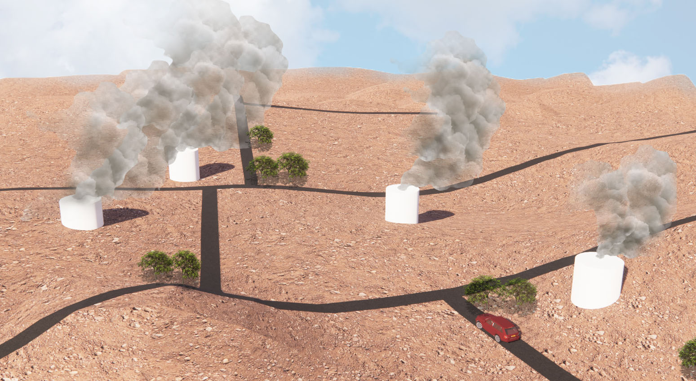

# Probabilistic Gas Leak Rate Estimation using Submodular Function Maximization with Routing Constraints
Harmful greenhouse gases such as methane are  prone to leak during extraction, transportation, and storage in oil fields. Therefore we must monitor gas leak rates to keep such fugitive emissions in check. However, most currently available approaches incur significant computational costs to generate informative paths for mobile sensors and estimate leak rates from the collected data. As such, they do not scale to large oil fields and are infeasible for real-time applications. We address these problems by deriving an efficient analytical approach to compute the leak rate distribution and Expected Entropy Reduction (EER) metric used for path generation. Moreover, a faster variant of a submodular function maximization algorithm is introduced, along with a generalization of the algorithm to find informative data collection walks with arc routing constraints. Our simulation experiments demonstrate the approach's validity and substantial computational gains.



## Paper
For more details, please see our paper [Probabilistic Gas Leak Rate Estimation using Submodular Function Maximization with Routing Constraints](https://ieeexplore.ieee.org/document/9706242) which has been accepted at [RA-L 2022](https://www.ieee-ras.org/publications/ra-l) and [ICRA 2022](https://www.icra2022.org/). If this code is useful for your work, please cite our paper:

```
@ARTICLE{jakkala2022probabilistic,
  author={Jakkala, Kalvik and Akella, Srinivas},
  journal={IEEE Robotics and Automation Letters}, 
  title={Probabilistic Gas Leak Rate Estimation Using Submodular Function Maximization With Routing Constraints}, 
  year={2022},
  volume={7},
  number={2},
  pages={5230-5237},
  doi={10.1109/LRA.2022.3149043}}
``` 

## Directory Structure
- `scripts/`: These scripts are used for all our experiments.
  - `scripts/benchmark_EER.py`: Script for generating the results of Table II in the paper, which benchmarks the EER computation time with the GEV prior and the Gaussian prior.
  - `scripts/benchmark_IPP.py`: Script for generating the results of Table IV in the paper, which benchmarks the performance of Path Iter, GCB, MGCB. 
  - `scripts/dispersion_model.py`: Implementation of the gas dispersion model used in our experiments.
  - `scripts/estimators.py`: Implementation of the GEV and Gaussian prior based leak rate estimators used in our experiments.
  - `scripts/gcb.py`: Implementation of the GCB and MGCB algorithms used in our experiments.
  - `scripts/path_iterator.py`: Implementation of the path iter algorithm used in our experiments.
  - `scripts/generate_graphs.py`: Script used to filter the oil well locations and generate the graphs used in our experiments.
  - `scripts/plots.ipynb`: Jupyter notebook used to generate the plots and other results used in our experiments.
  - `scripts/gas_dispersion_model.ipynb`: Jupyter notebook used to test and plot the gas dispersion model used in our experiments.
- `data/`: Graphs generated using the generate_graphs.py script.
- `sols/`: Solution paths generated using the benchmark_IPP.py script.
- `Supplemental.pdf`: Supplemental material for the paper, contains the derivation of our method. 
     
## Oil well location dataset 
We used the 2016 U.S. Oil & Gas Activity dataset in the paper.
The complete dataset can be downloaded from [here](https://www.fractracker.org/map/national/us-oil-gas/)

## Requirements
-The requirements.txt file contains the required python packages for the scripts.
-The repo also depends on the [LineCoverage-library](https://github.com/kdkalvik/LineCoverage-library), which needs to be build from source.

## Funding 
This work was supported in part by NSF Award IIP-1919233.
